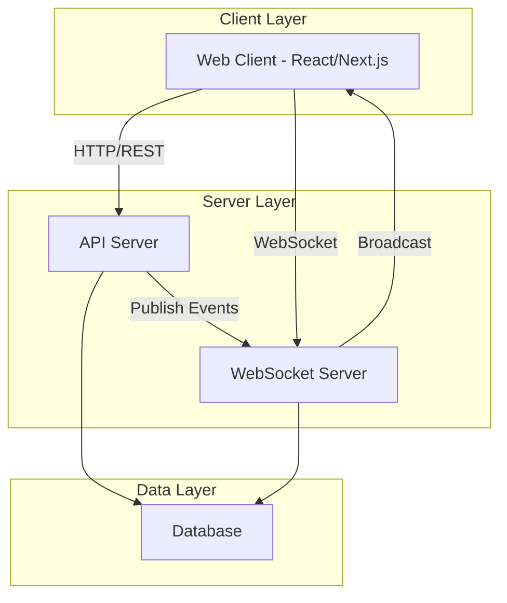
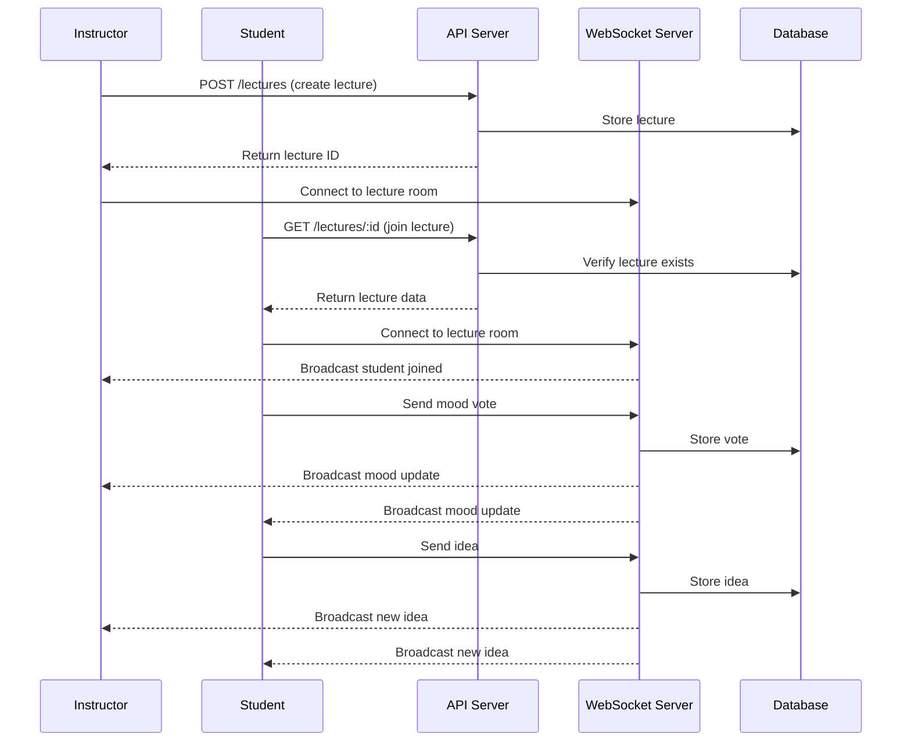

# Design Document: Lecture Mood Tracker

## Overview

The Lecture Mood Tracker is a real-time web application that enables instructors to create lectures and students to join them, vote on the current mood of the lecture, and share ideas or feedback. The system provides live updates across all participants, allowing instructors to gauge student engagement and understanding in real-time. The application uses WebSocket connections for real-time bidirectional communication, ensuring that mood votes and ideas are instantly reflected across all connected clients.

The system is built on a client-server architecture where the frontend (React/Next.js) communicates with a backend API that manages lecture state and coordinates real-time updates through WebSocket connections. The design prioritizes low latency for mood updates and scalability to support multiple concurrent lectures with varying numbers of participants.

## Architecture




## Main Workflow




## Components and Interfaces

### Component 1: Lecture Service

**Purpose**: Manages lecture lifecycle including creation, retrieval, and state management

**Interface**:
```typescript
interface LectureService {
  createLecture(data: CreateLectureInput): Promise<Lecture>
  getLecture(id: string): Promise<Lecture | null>
  listLectures(filters?: LectureFilters): Promise<Lecture[]>
  endLecture(id: string): Promise<void>
  getLectureStats(id: string): Promise<LectureStats>
}

interface CreateLectureInput {
  title: string
  description?: string
  instructorId: string
  scheduledAt?: Date
}

interface LectureFilters {
  instructorId?: string
  status?: LectureStatus
  startDate?: Date
  endDate?: Date
}
```

**Responsibilities**:
- Validate lecture creation inputs
- Persist lecture data to database
- Retrieve lecture information
- Calculate and aggregate lecture statistics
- Manage lecture status transitions (active, ended)


### Component 2: Mood Voting Service

**Purpose**: Handles real-time mood voting and aggregation

**Interface**:
```typescript
interface MoodVotingService {
  submitVote(vote: MoodVote): Promise<void>
  getCurrentMood(lectureId: string): Promise<MoodAggregation>
  getMoodHistory(lectureId: string, timeRange?: TimeRange): Promise<MoodSnapshot[]>
  getUserVote(lectureId: string, userId: string): Promise<MoodType | null>
}

interface MoodVote {
  lectureId: string
  userId: string
  mood: MoodType
  timestamp: Date
}

interface MoodAggregation {
  lectureId: string
  distribution: Record<MoodType, number>
  totalVotes: number
  dominantMood: MoodType
  lastUpdated: Date
}

type MoodType = 'confused' | 'bored' | 'neutral' | 'engaged' | 'excited'

interface TimeRange {
  start: Date
  end: Date
}

interface MoodSnapshot {
  timestamp: Date
  distribution: Record<MoodType, number>
}
```

**Responsibilities**:
- Accept and validate mood votes from students
- Update user's current mood vote (one vote per user)
- Calculate real-time mood distribution across all participants
- Maintain mood history for analytics
- Determine dominant mood based on vote distribution


### Component 3: Ideas Service

**Purpose**: Manages student ideas and feedback submission

**Interface**:
```typescript
interface IdeasService {
  submitIdea(idea: CreateIdeaInput): Promise<Idea>
  getIdeas(lectureId: string, options?: IdeaQueryOptions): Promise<Idea[]>
  upvoteIdea(ideaId: string, userId: string): Promise<void>
  deleteIdea(ideaId: string, userId: string): Promise<void>
}

interface CreateIdeaInput {
  lectureId: string
  userId: string
  content: string
  isAnonymous?: boolean
}

interface Idea {
  id: string
  lectureId: string
  userId: string
  content: string
  isAnonymous: boolean
  upvotes: number
  createdAt: Date
  authorName?: string
}

interface IdeaQueryOptions {
  sortBy?: 'recent' | 'popular'
  limit?: number
  offset?: number
}
```

**Responsibilities**:
- Validate and store student ideas
- Support anonymous idea submission
- Handle idea upvoting
- Retrieve ideas with sorting and pagination
- Allow users to delete their own ideas


### Component 4: WebSocket Manager

**Purpose**: Manages real-time bidirectional communication between server and clients

**Interface**:
```typescript
interface WebSocketManager {
  handleConnection(socket: WebSocket, userId: string): void
  handleDisconnection(socket: WebSocket): void
  joinLectureRoom(socket: WebSocket, lectureId: string): Promise<void>
  leaveLectureRoom(socket: WebSocket, lectureId: string): void
  broadcastToRoom(lectureId: string, event: WebSocketEvent): void
  sendToUser(userId: string, event: WebSocketEvent): void
}

interface WebSocketEvent {
  type: EventType
  payload: unknown
  timestamp: Date
}

type EventType = 
  | 'mood_updated'
  | 'idea_created'
  | 'idea_upvoted'
  | 'student_joined'
  | 'student_left'
  | 'lecture_ended'

interface MoodUpdatedPayload {
  lectureId: string
  aggregation: MoodAggregation
}

interface IdeaCreatedPayload {
  lectureId: string
  idea: Idea
}

interface StudentJoinedPayload {
  lectureId: string
  studentCount: number
}
```

**Responsibilities**:
- Establish and maintain WebSocket connections
- Manage lecture room subscriptions
- Broadcast events to all participants in a lecture
- Send targeted messages to specific users
- Handle connection lifecycle (connect, disconnect, reconnect)
- Implement heartbeat mechanism for connection health


### Component 5: Authentication Service

**Purpose**: Manages user authentication and authorization

**Interface**:
```typescript
interface AuthService {
  authenticateUser(credentials: Credentials): Promise<AuthResult>
  validateToken(token: string): Promise<User | null>
  refreshToken(refreshToken: string): Promise<AuthResult>
  getUserRole(userId: string): Promise<UserRole>
}

interface Credentials {
  email: string
  password: string
}

interface AuthResult {
  user: User
  accessToken: string
  refreshToken: string
  expiresIn: number
}

interface User {
  id: string
  email: string
  name: string
  role: UserRole
}

type UserRole = 'instructor' | 'student'
```

**Responsibilities**:
- Authenticate users with credentials
- Generate and validate JWT tokens
- Manage token refresh flow
- Determine user roles and permissions
- Secure WebSocket connections with token validation


## Data Models

### Model 1: Lecture

```typescript
interface Lecture {
  id: string
  title: string
  description: string | null
  instructorId: string
  status: LectureStatus
  createdAt: Date
  startedAt: Date | null
  endedAt: Date | null
  scheduledAt: Date | null
}

type LectureStatus = 'scheduled' | 'active' | 'ended'
```

**Validation Rules**:
- `id` must be a valid UUID
- `title` must be non-empty string, max 200 characters
- `description` max 1000 characters if provided
- `instructorId` must reference an existing user with instructor role
- `status` must be one of the defined enum values
- `startedAt` must be after `createdAt` when set
- `endedAt` must be after `startedAt` when set

### Model 2: MoodVote

```typescript
interface MoodVoteRecord {
  id: string
  lectureId: string
  userId: string
  mood: MoodType
  createdAt: Date
  updatedAt: Date
}
```

**Validation Rules**:
- `lectureId` must reference an existing active lecture
- `userId` must reference an existing user
- `mood` must be one of: 'confused', 'bored', 'neutral', 'engaged', 'excited'
- Only one active vote per user per lecture (upsert behavior)
- Cannot vote on ended lectures


### Model 3: Idea

```typescript
interface IdeaRecord {
  id: string
  lectureId: string
  userId: string
  content: string
  isAnonymous: boolean
  upvotes: number
  createdAt: Date
  deletedAt: Date | null
}
```

**Validation Rules**:
- `lectureId` must reference an existing lecture
- `userId` must reference an existing user
- `content` must be non-empty string, max 500 characters
- `upvotes` must be non-negative integer
- `isAnonymous` defaults to false
- Soft delete: set `deletedAt` instead of removing record

### Model 4: IdeaUpvote

```typescript
interface IdeaUpvote {
  id: string
  ideaId: string
  userId: string
  createdAt: Date
}
```

**Validation Rules**:
- `ideaId` must reference an existing non-deleted idea
- `userId` must reference an existing user
- One upvote per user per idea (unique constraint on ideaId + userId)
- Cannot upvote deleted ideas


### Model 5: LectureParticipant

```typescript
interface LectureParticipant {
  id: string
  lectureId: string
  userId: string
  joinedAt: Date
  leftAt: Date | null
  isActive: boolean
}
```

**Validation Rules**:
- `lectureId` must reference an existing lecture
- `userId` must reference an existing user
- `joinedAt` must be within lecture active period
- `leftAt` must be after `joinedAt` when set
- `isActive` indicates current connection status
- Track multiple join/leave events per user


## Key Functions with Formal Specifications

### Function 1: submitMoodVote()

```typescript
async function submitMoodVote(
  lectureId: string,
  userId: string,
  mood: MoodType
): Promise<MoodAggregation>
```

**Preconditions:**
- `lectureId` references an existing lecture with status 'active'
- `userId` references an authenticated user
- `mood` is a valid MoodType enum value
- User is a participant in the lecture

**Postconditions:**
- User's mood vote is stored or updated in database
- If previous vote exists for user, it is replaced (not duplicated)
- MoodAggregation is recalculated with new vote included
- WebSocket event is broadcast to all lecture participants
- Returns current MoodAggregation reflecting the new vote

**Loop Invariants:** N/A (no loops in function)

### Function 2: calculateMoodAggregation()

```typescript
function calculateMoodAggregation(votes: MoodVoteRecord[]): MoodAggregation
```

**Preconditions:**
- `votes` is an array of MoodVoteRecord objects
- All votes in array belong to the same lecture
- Each userId appears at most once in the votes array

**Postconditions:**
- Returns MoodAggregation with correct distribution counts
- `totalVotes` equals the length of votes array
- Sum of all distribution values equals totalVotes
- `dominantMood` is the mood with highest count (ties broken by enum order)
- All MoodType values are represented in distribution (count 0 if no votes)

**Loop Invariants:**
- For each iteration processing a vote: sum of processed distribution values equals iteration count
- All previously processed votes are correctly counted in distribution


### Function 3: broadcastToLectureRoom()

```typescript
async function broadcastToLectureRoom(
  lectureId: string,
  event: WebSocketEvent
): Promise<void>
```

**Preconditions:**
- `lectureId` is a valid lecture identifier
- `event` is a well-formed WebSocketEvent with valid type and payload
- WebSocket server is running and accepting connections
- At least one client is connected to the lecture room (or function no-ops gracefully)

**Postconditions:**
- Event is sent to all active WebSocket connections in the lecture room
- Failed sends to disconnected clients are handled gracefully
- Disconnected clients are removed from room participant list
- Function completes without throwing errors
- No modification to event payload during broadcast

**Loop Invariants:**
- For each client in room: if send succeeds, client remains in room; if send fails, client is marked for removal
- All previously processed clients have received the event or been marked for removal

### Function 4: joinLectureRoom()

```typescript
async function joinLectureRoom(
  socket: WebSocket,
  lectureId: string,
  userId: string
): Promise<void>
```

**Preconditions:**
- `socket` is an open WebSocket connection
- `lectureId` references an existing lecture with status 'active'
- `userId` is authenticated and authorized to join lecture
- Socket is not already in another lecture room

**Postconditions:**
- Socket is added to lecture room's participant list
- LectureParticipant record is created or updated with isActive=true
- 'student_joined' event is broadcast to all other participants
- Current lecture state (mood, ideas) is sent to joining user
- Function returns successfully or throws specific error

**Loop Invariants:** N/A (no loops in function)


### Function 5: submitIdea()

```typescript
async function submitIdea(input: CreateIdeaInput): Promise<Idea>
```

**Preconditions:**
- `input.lectureId` references an existing active lecture
- `input.userId` references an authenticated user who is a participant
- `input.content` is non-empty and within character limit (500 chars)
- `input.isAnonymous` is a boolean value

**Postconditions:**
- Idea record is persisted to database with unique ID
- If isAnonymous=true, authorName is not included in returned Idea
- If isAnonymous=false, authorName is populated from user record
- 'idea_created' event is broadcast to all lecture participants
- Returns complete Idea object with generated ID and timestamp
- `upvotes` is initialized to 0

**Loop Invariants:** N/A (no loops in function)

